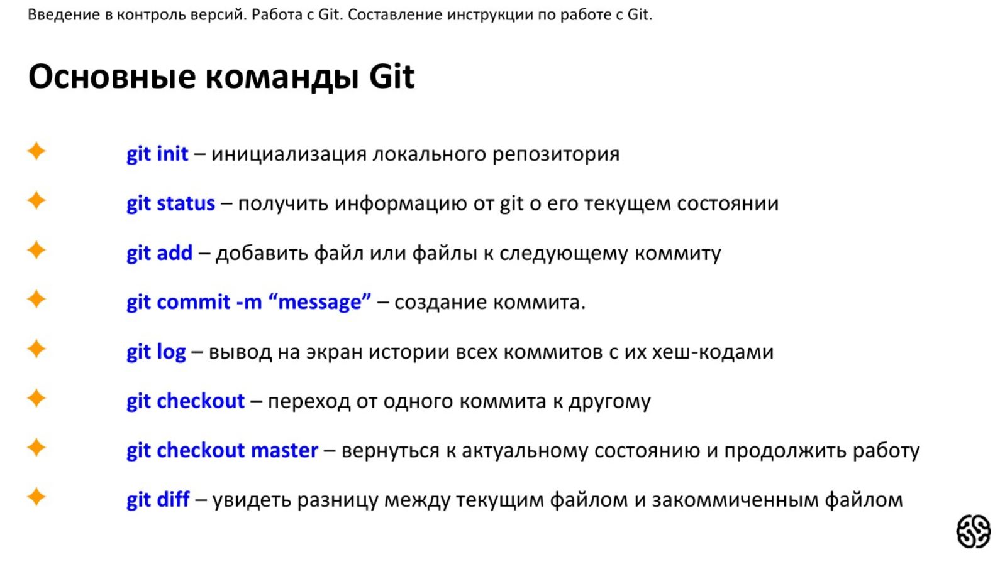

# Инструкция для работы с Git и удалёнными репозиториями

1. Что такое Git
2. Подготовка репозитория
3. Коммиты
3.1. Добавление изменений в коммит
3.2. Просмотр состояния репозитория
3.3. Создание коммитов
3.4. Перемещение между сохранениями
3.5. Откат последнего коммита
4. Цитаты
5. Ссылки
6. Картинки
7. Журнал изменений
8. Ветки 
8.1. Создание ветки
8.2. Слияние веток
8.3. Удаление веток
9. Удалённые репозитории
9.1. Отправка изменений в удаленный репозиторий
9.2. Получение изменений из удаленного репозитория
9. Примеры
## 1. Что такое Git?
Git - это одна из реализаций распределённых систем контроля версий, имеющая как и локальные, так и удалённые репозитории. Является самой популярной реализацией систем контроля версий в мире.
## 2. Подготовка репозитория
Для создание репозитория необходимо выполнить команду *git init*  в папке с репозиторием и у Вас создаться репозиторий (появится скрытая папка .git)

## 3. Коммиты

### 3.1. Добавление изменений в коммит = git add
Для добавления измений в коммит используется команда *git add*. Чтобы использовать команду *git add* напишите *git add <имя файла>*

### 3.2. Просмотр состояния репозитория = git status
Для того, чтобы посмотреть состояние репозитория используется команда *git status*. Для этого необходимо в папке с репозиторием написать *git status*, и Вы увидите были ли измения в файлах, или их не было.

### 3.3. Создание коммитов = git commite
Для того, чтобы создать коммит(сохранение) необходимо выполнить команду *git commit*. Выполняется она так: *git commit -m "<сообщение к коммиту>*. Все файлы для коммита должны быть ***ДОБАВЛЕНЫ*** и сообщение к коммиту писать ***ОБЯЗАТЕЛЬНО***.

### 3.4. Перемещение между сохранениями = git checkout
Для того, чтобы перемещаться между коммитами, используется команда *git checkout*. Используется она в папке с пепозиторием следующим образом: *git checkout <номер коммита>*

### 3.5. Откат послежнего коммита = git revert

Откатить последний коммит можно с помощью параметра *revert*. Создастся новый коммит, содержащий обратные преобразования относительно предыдущего, и добавится к истории текущей ветки

> git revert HEAD
## 4. Цитаты
Для обозначения цитат в языке Markdown используется знак «больше» («>»). Его можно вставлять как перед каждой строкой цитаты, так и только перед первой строкой параграфа. Цитаты в языке Markdown выглядят следующим образом: 

>Это пример цитаты,
>в которой перед каждой строкой
>ставится угловая скобка.

>Это пример цитаты,
в которой угловая скобка
ставится только перед началом нового параграфа.
>Второй параграф.

## 5. Ссылки

Markdown поддерживает два стиля оформления ссылок:
* Гиперссылка, с немедленным указанием адреса (внутритекстовая);
* Гиперссылка, подобная сноске.

Подразумевается, что помимо URL-адреса существует еще текст ссылки. Он заключается в квадратные скобки. Для создания внутритекстовой гиперссылки необходимо использовать круглые скобки сразу после закрывающей квадратной. Внутри них необходимо поместить URL-адрес. В них же возможно расположить название, заключенное в кавычки, которое будет отображаться при наведении, но этот пункт не является обязательным.

>[пример] (http://example.com/ "Необязательная подсказка")

В результате на экран выводится следующее: пример. 
При ссылке на локальную директорию возможно использование относительного пути (от текущей страницы, сайта и т.п.)

При создании сносной гиперссылки вместо целевого адреса используется вторая пара квадратных скобок, внутри которых помещается метка, идентификатор ссылки (id).

> [пример][id]:

## 6. Картинки

Для вставки картинки в документ применяется команда в формате:

> ![Альтернативный текст] (/путь/к/изображению.jpg)

Команда состоит из следующих элементов:

* восклицательный знак;
* квадратные скобки, в которых указывается альтернативный изображению текст (он станет содержимым атрибута в элементе img);
* круглые скобки, содержащие URL-адрес или относительный путь изображения, а также (необязательно) всплывающую подсказку, заключённуе в двойные или одиночные кавычки.

## 7. Журнал изменений = git log
Для того, чтобы посмотреть все сделанные изменения в репозитории, используется команда *git log*. Для этого достаточно выполнить команду *git log* в папке с репозиторием

По умолчанию (без аргументов) git log перечисляет коммиты, сделанные в репозитории в обратном к хронологическому порядке — последние коммиты находятся вверху. 
## 8. Ветки в Git

### 8.1. Создание ветки

Для того, чтобы создать ветку, используется команда *git branch*. Делается это следующим образом в папке с репозиторием: *git branch <название новой ветки>*

### 8.2. Слияние веток

Для того чтобы дабавить ветку в текущую ветку используется команда *git merge <name branch>*

### 8.3. Удаление веток
Для удаления ветки ввести команду "git branch -d 'name branch'"

## 9 Удалённые репозитории

### 9.1. Отправка изменений в удаленный репозиторий

Когда вы хотите поделиться своими наработками, вам необходимо отправить их в удалённый репозиторий. Команда для этого действия простая: git push <remote-name> <branch-name>. Чтобы отправить вашу ветку master на сервер origin (повторимся, что клонирование обычно настраивает оба этих имени автоматически), вы можете выполнить следующую команду для отправки ваших коммитов:

> git push origin master

### 9.2. Получение изменений из удаленного репозитория

Для загрузки изменений из удалённого репозитория используется параметр *pull*. Он скачивает копию текущей ветки с указанного удалённого репозитория и объединяет её с локальной копией.

> git pull

## 10.Примеры

Так выглядит картинка, вставленная в текст

